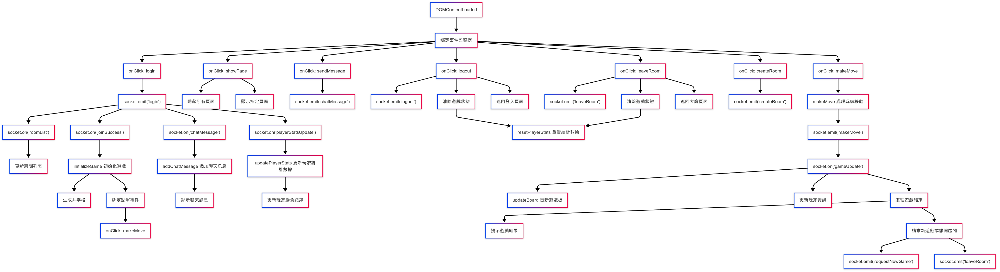

# 井字遊戲 - 線上多人版本

這是一個使用 Node.js、Socket.IO 和原生 JavaScript 開發的線上多人井字遊戲。玩家可以創建房間、加入其他玩家的房間，並進行即時對戰。

## 系統架構


### 架構說明

系統採用前後端分離的架構設計，主要由以下幾個部分組成：

#### 1. 後端 (server.js)
- 房間管理系統：處理房間的創建、加入和刪除
- 遊戲邏輯處理：維護遊戲狀態、判斷勝負
- Socket.IO 事件處理：管理所有即時通訊事件
- 用戶狀態管理：追踪用戶登入狀態和房間歸屬

#### 2. 前端 (index.html)
- 用戶界面：響應式設計的遊戲界面
- 遊戲操作邏輯：處理用戶的遊戲操作
- 即時通訊處理：與後端的 Socket.IO 連接
- 狀態更新：即時更新遊戲狀態和界面

#### 3. Socket.IO 連接
- 提供前後端之間的即時雙向通訊
- 確保遊戲狀態的即時同步
- 處理即時消息的傳遞

#### 4. 數據流
- 遊戲狀態同步：確保所有玩家看到相同的遊戲狀態
- 用戶操作傳遞：即時傳遞玩家的操作
- 聊天消息：處理玩家間的即時通訊
- 房間狀態更新：同步房間的最新狀態

## 函式呼叫關係圖

以下是完整的函式呼叫關係圖，展示了從頁面載入到遊戲結束的所有重要函式呼叫：



### 主要流程說明：

1. **頁面初始化**
   - DOMContentLoaded 事件觸發後，綁定所有必要的事件監聽器
   - 包括登入、頁面切換、發送訊息、登出等基本功能

2. **登入流程**
   - 用戶點擊登入按鈕觸發 login 事件
   - 發送 socket.emit('login') 到伺服器
   - 接收 roomList、joinSuccess、gameUpdate 和 chatMessage 等事件

3. **遊戲操作**
   - makeMove：處理玩家下棋動作
   - gameUpdate：更新遊戲狀態、玩家資訊
   - 遊戲結束處理：顯示結果、提供新遊戲選項

4. **房間管理**
   - createRoom：創建新房間
   - leaveRoom：離開當前房間
   - 包含狀態清理和頁面切換

5. **聊天功能**
   - sendMessage：發送聊天訊息
   - chatMessage 事件處理：顯示接收到的訊息

## 功能特點

- 🎮 即時多人對戰
- 🚪 房間系統
- 💬 即時聊天功能
- 📊 玩家統計
- 🎯 自動配對
- 🔒 簡單的用戶認證系統

## 技術棧

- 前端：HTML、JavaScript、Tailwind CSS
- 後端：Node.js、Express
- 即時通訊：Socket.IO

## 安裝步驟

1. 克隆專案
```bash
git clone https://github.com/ChenWells/Tic-Tac-Toe-online.git
cd Tic-Tac-Toe-online
```

2. 安裝依賴
```bash
npm install
```

3. 啟動服務器
```bash
node server.js
```

4. 在瀏覽器中訪問
```
http://localhost:3000
```

## 測試帳號

為方便測試，系統提供了以下測試帳號：

- 用戶名：player1，密碼：123
- 用戶名：player2，密碼：123
- 用戶名：player3，密碼：123

## 遊戲規則

1. 玩家可以創建新房間或加入現有房間
2. 每個房間限制 2 名玩家
3. 第一個加入的玩家使用 X，第二個玩家使用 O
4. 玩家輪流在 3x3 的格子中放置自己的符號
5. 首先在橫、直或對角線上連成一線的玩家獲勝

## 開發者

- 作者：Chen FuKuo
- GitHub：[ChenWells](https://github.com/ChenWells)

## 授權

本專案採用 MIT 授權條款 - 詳見 [LICENSE](LICENSE) 文件 